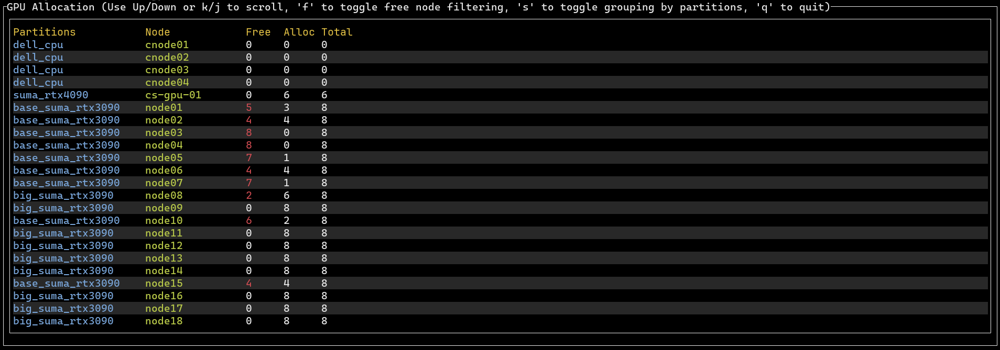

`turm_gpu` is a rust-based TUI for inspecting GPU resources in a slurm enviroment.
It internally uses `scontrol` for the data retrieval.

## Installation

If you know `cargo`,
```bash
cargo install turm_gpu
```

WARNING: `pip` installation is not working yet.

If you know `pip`,

```bash
pip install turm-gpu
```

or use `pipx`.

## Usage

```bash
turm_gpu
```

The rest should be straightforward.
